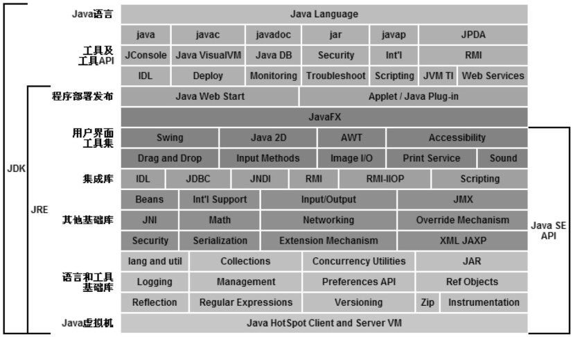

# 第一章 - 走近Java

[TOC]

## JDK

我们可以把Java程序设计语言、Java虚拟机、Java API类库这三部分统称为JDK（Java Development Kit）,可以把Java API类库中的Java SE API子集和Java虚拟机这两部分统称为JRE（Java Runtime Environment），JRE是支持Java程序运行的标准环境。

Java技术体系可以分为4个平台：

* **Java Card：**支持一些Java小程序（Applets）运行在小内存设备（如智能卡）上的平台。
* **Java ME（Micro Edition）：**支持Java程序运行在移动终端（如手机、PDA）上的平台，对Java Api有所精简，并加入了针对移动终端的支持，这个版本以前称为J2ME。
* **Java SE（Standard Edition）：**支持面向桌面级应用（如Windows下的应用程序）的Java平台，提供了完整的Java核心API，这个版本以前称为J2SE
* **Java EE（Enterprise Edition）：**支持使用多层架构的企业应用（如ERP、CRM应用）的Java平台，除了提供Java SE API外，还对其做了大量的扩充并提供了相关的部署支持，这个版本以前称为J2EE。

